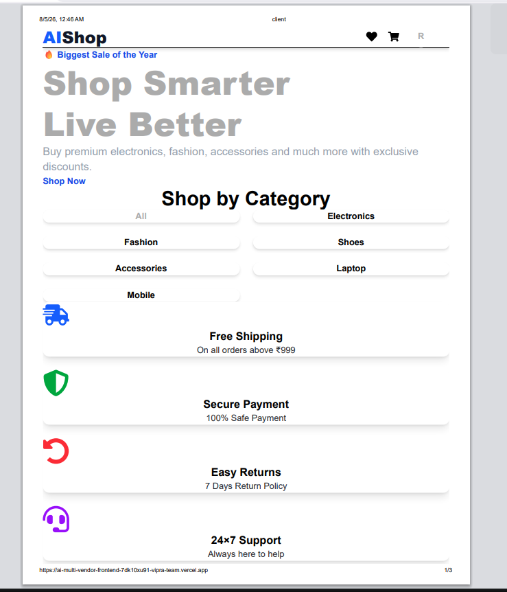
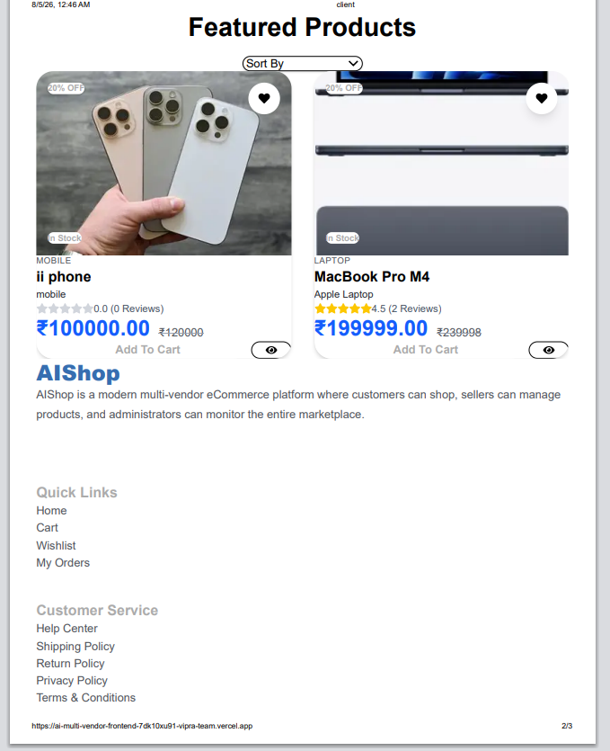
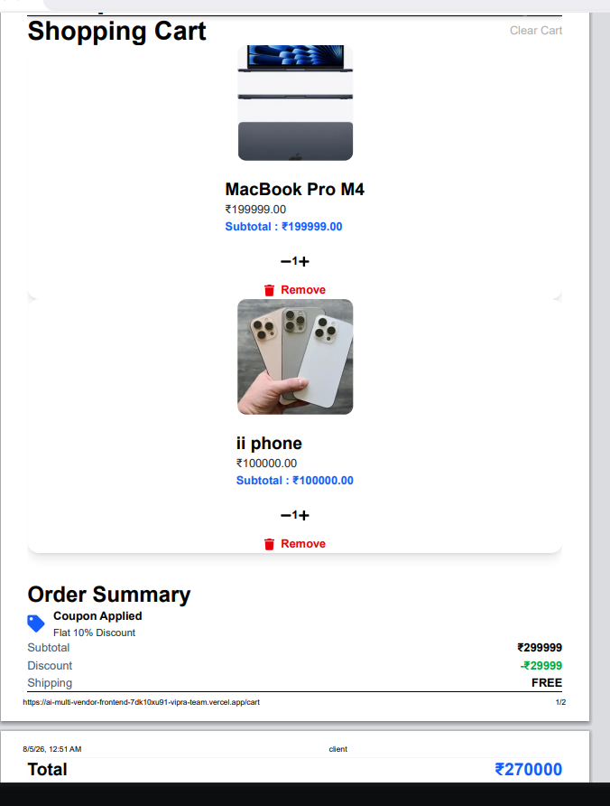
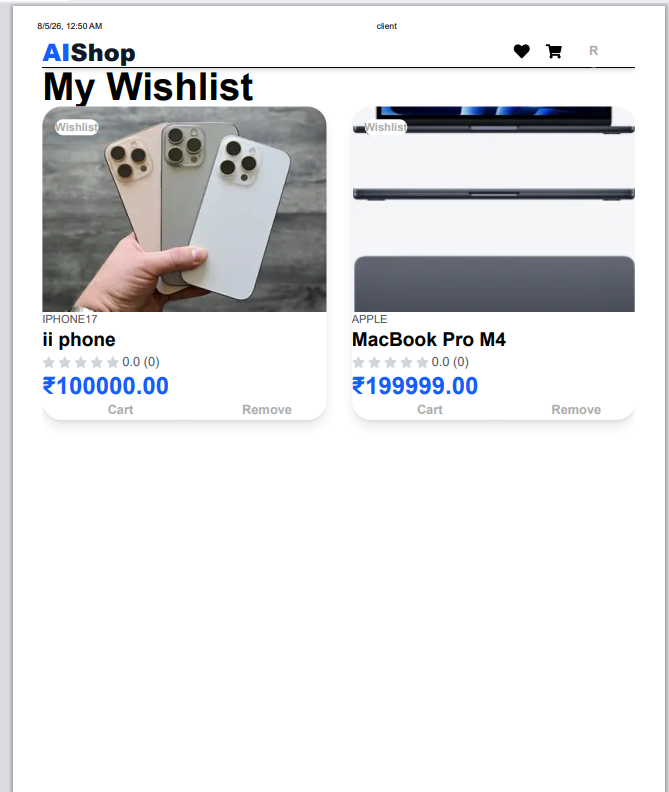
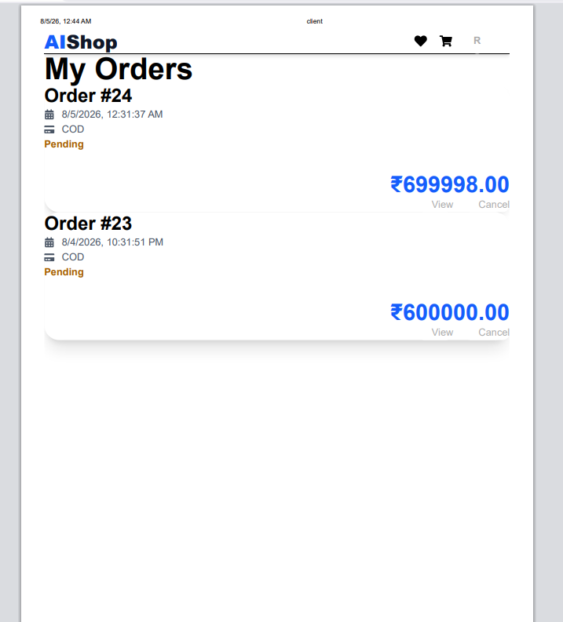
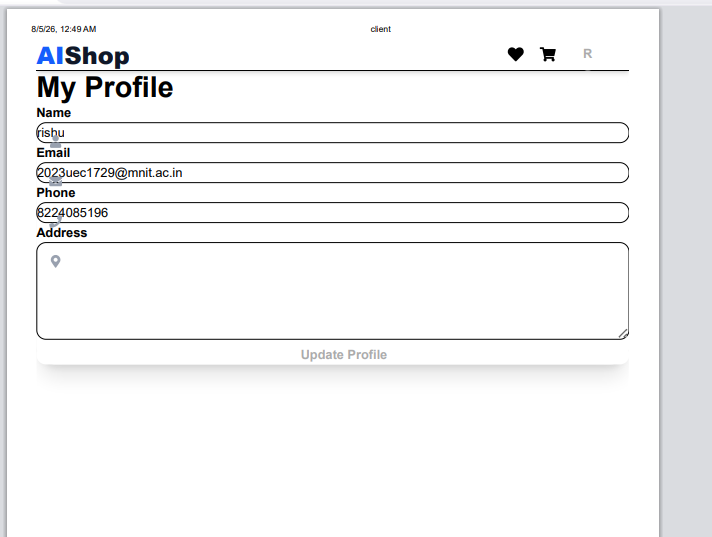

# React + Vite

This template provides a minimal setup to get React working in Vite with HMR and some ESLint rules.

Currently, two official plugins are available:

- [@vitejs/plugin-react](https://github.com/vitejs/vite-plugin-react/blob/main/packages/plugin-react) uses [Oxc](https://oxc.rs)
- [@vitejs/plugin-react-swc](https://github.com/vitejs/vite-plugin-react/blob/main/packages/plugin-react-swc) uses [SWC](https://swc.rs/)# 🛒 AI Multi-Vendor E-Commerce Frontend

A modern, responsive and production-ready Multi-Vendor E-Commerce Frontend built using **React**, **Vite**, **Tailwind CSS**, and **Axios**.

🌐 **Live Demo:**  
https://ai-multi-vendor-frontend-7dk10xu91-vipra-team.vercel.app/

---

# 📸 Project Screenshots

## 🏠 Home Page



---

## 🛍 Products



---

## 📦 Product Details


---

## 🛒 Shopping Cart



---

## ❤️ Wishlist



---

## 📦 Orders



---

## 👤 Profile


-----
# ✨ Features

- 🔐 JWT Authentication
- 👤 Customer Dashboard
- 🛍 Browse Products
- 🔍 Search Products
- 🎯 Filter & Sort Products
- ❤️ Wishlist
- 🛒 Shopping Cart
- 💳 Checkout
- 📦 Order Management
- ⭐ Product Reviews
- 👨‍💼 Seller Dashboard
- 📊 Admin Dashboard
- 📱 Fully Responsive Design

---

# 🛠 Tech Stack

- React 19
- Vite
- Tailwind CSS
- Axios
- React Router DOM
- React Hot Toast
- React Icons

---

# 📂 Folder Structure

```
src
├── api
├── components
├── context
├── hooks
├── layouts
├── pages
├── routes
├── services
├── utils
└── main.jsx
```

---

# 🚀 Installation

Clone the repository

```bash
git clone https://github.com/vipratripathi745/AI-MultiVendor-Frontend.git
```

Go to project

```bash
cd AI-MultiVendor-Frontend
```

Install dependencies

```bash
npm install
```

Start development server

```bash
npm run dev
```

---

# ⚙️ Environment Variables

Create a `.env` file

```env
VITE_API_URL=https://ai-multivendor-backend.onrender.com/api
```

---

# 🌐 Backend Repository

https://github.com/vipratripathi745/AI-MultiVendor-Ecommerce

---

# 👨‍💻 Author

**Vipra Tripathi**

GitHub

https://github.com/vipratripathi745

---

# ⭐ Support

If you like this project, consider giving it a ⭐ on GitHub.

## React Compiler

The React Compiler is not enabled on this template because of its impact on dev & build performances. To add it, see [this documentation](https://react.dev/learn/react-compiler/installation).

## Expanding the ESLint configuration

If you are developing a production application, we recommend using TypeScript with type-aware lint rules enabled. Check out the [TS template](https://github.com/vitejs/vite/tree/main/packages/create-vite/template-react-ts) for information on how to integrate TypeScript and [`typescript-eslint`](https://typescript-eslint.io) in your project.
